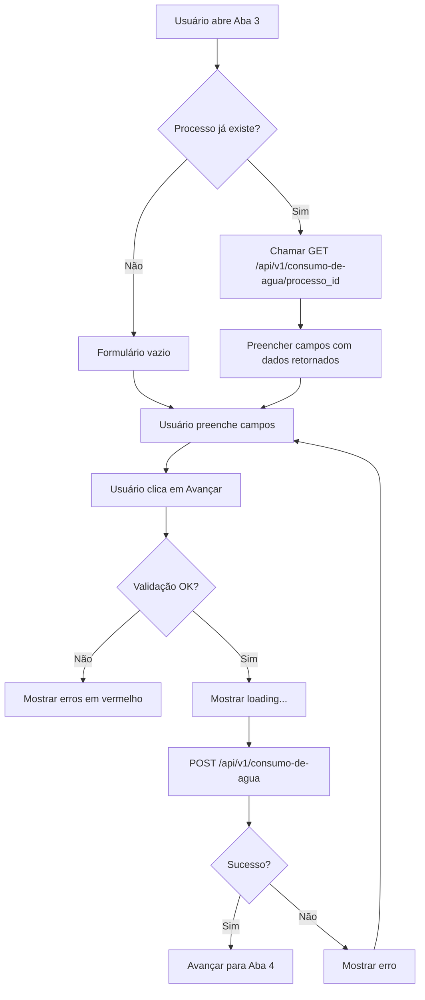

# Prompts para bolt.new - Implementar Aba 3 (Consumo de Água)

**Data:** 30/10/2025
**Objetivo:** Implementar front-end para consumir a API da Aba 3 - Consumo de Água
**API Endpoint:** `POST /api/v1/consumo-de-agua`
**Status:** ✅ Script SQL executado no Supabase | ✅ Deploy em produção realizado

---

## 📋 PREPARAÇÃO (Antes de começar)

### Informações da API:

1. **URL Base:** 
   - Desenvolvimento: `http://localhost:8000`
   - Produção: `https://fastapi-sandbox-ee3p.onrender.com`

2. **Endpoints:**
   - **POST (Criar/Atualizar):** `/api/v1/consumo-de-agua`
   - **GET (Buscar):** `/api/v1/consumo-de-agua/{processo_id}`
   - **DELETE (Deletar):** `/api/v1/consumo-de-agua/{processo_id}`

3. **Swagger/Documentação:** `https://fastapi-sandbox-ee3p.onrender.com/docs`

4. **⚠️ IMPORTANTE:** 
   - A aba 3 do formulário já existe visualmente
   - NÃO mexer no layout/design existente
   - APENAS conectar com a API
   - Manter validações visuais já implementadas

---

## 📦 PAYLOAD DE EXEMPLO COMPLETO

```json
{
  "processo_id": "PROC-2025-001234",
  "origem_rede_publica": true,
  "origem_poco_artesiano": false,
  "origem_poco_cacimba": false,
  "origem_captacao_superficial": true,
  "origem_captacao_pluvial": false,
  "origem_caminhao_pipa": false,
  "origem_outro": false,
  "consumo_uso_humano_m3_dia": 15.5,
  "consumo_outros_usos_m3_dia": 25.0,
  "volume_despejo_diario_m3_dia": 35.0,
  "destino_final_efluente": "Rede de Esgoto Municipal"
}
```

### 📝 Opções para Destino Final do Efluente:
```json
[
  "Rede de Esgoto Municipal",
  "Fossa Séptica",
  "Fossa Rudimentar",
  "Sumidouro",
  "Curso d'água (rio, lago, etc)",
  "Solo (infiltração)",
  "Estação de Tratamento Própria (ETE)",
  "Outro"
]
```

---

## 🎯 PROMPT 1: Criar Interfaces TypeScript

```
Preciso criar as interfaces TypeScript para o formulário de Consumo de Água (Etapa 3 de 7).

CONTEXTO:
- Tela: "Uso de Água" (Etapa 3)
- Endpoint POST: /api/v1/consumo-de-agua
- Endpoint GET: /api/v1/consumo-de-agua/{processo_id}
- A tela já existe visualmente, apenas conectar com a API

ESTRUTURA DE DADOS:

O formulário tem 3 seções principais:
1. **Origem da Água** (checkboxes - múltipla seleção)
2. **Consumo de Água** (campos numéricos em m³/dia)
3. **Efluentes** (volume e destino final)

TAREFA:
Crie as seguintes interfaces TypeScript:

```typescript
// Interface principal do formulário (REQUEST - envio para API)
interface ConsumoDeAguaRequest {
  processo_id: string;
  
  // Origem da Água (múltiplas seleções possíveis)
  origem_rede_publica: boolean;
  origem_poco_artesiano: boolean;
  origem_poco_cacimba: boolean;
  origem_captacao_superficial: boolean;
  origem_captacao_pluvial: boolean;
  origem_caminhao_pipa: boolean;
  origem_outro: boolean;
  
  // Consumo de Água (valores em m³/dia)
  consumo_uso_humano_m3_dia?: number;
  consumo_outros_usos_m3_dia?: number;
  
  // Efluentes
  volume_despejo_diario_m3_dia?: number;
  destino_final_efluente?: string;
}

// Interface para resposta da API (RESPONSE)
interface ConsumoDeAguaResponse {
  id: string;
  processo_id: string;
  
  // Origem da Água
  origem_rede_publica: boolean;
  origem_poco_artesiano: boolean;
  origem_poco_cacimba: boolean;
  origem_captacao_superficial: boolean;
  origem_captacao_pluvial: boolean;
  origem_caminhao_pipa: boolean;
  origem_outro: boolean;
  
  // Consumo de Água
  consumo_uso_humano_m3_dia?: number;
  consumo_outros_usos_m3_dia?: number;
  
  // Efluentes
  volume_despejo_diario_m3_dia?: number;
  destino_final_efluente?: string;
  
  // Metadados
  created_at: string;
  updated_at: string;
}

// Type para opções de destino final
type DestinoFinalEfluente = 
  | "Rede de Esgoto Municipal"
  | "Fossa Séptica"
  | "Fossa Rudimentar"
  | "Sumidouro"
  | "Curso d'água (rio, lago, etc)"
  | "Solo (infiltração)"
  | "Estação de Tratamento Própria (ETE)"
  | "Outro";
```

ONDE CRIAR:
- Se já existe arquivo de types/interfaces do formulário, adicionar nesse arquivo
- Caso contrário, criar em: `src/types/consumo-agua.types.ts`

⚠️ NÃO MEXER em nada além da criação dessas interfaces.
```

---

## 🎯 PROMPT 2: Identificar e Mapear Campos do Formulário

```
Preciso mapear os campos existentes do formulário da Aba 3 (Uso de Água) para conectar com a API.

CONTEXTO:
- A tela da Aba 3 já existe visualmente
- Preciso apenas identificar os campos e conectar com a API
- NÃO alterar layout ou design

TAREFA:
1. Localize o componente/arquivo do formulário da Etapa 3 (Uso de Água)
2. Identifique os seguintes campos e seus nomes/IDs atuais:

**SEÇÃO: Origem da Água**
- [ ] Checkbox: Rede Pública
- [ ] Checkbox: Poço Artesiano
- [ ] Checkbox: Poço Cacimba
- [ ] Checkbox: Captação Superficial
- [ ] Checkbox: Captação Pluvial
- [ ] Checkbox: Caminhão Pipa
- [ ] Checkbox: Outro

**SEÇÃO: Consumo de Água**
- [ ] Input numérico: Consumo para Uso Humano (m³/dia)
- [ ] Input numérico: Consumo para Outros Usos (m³/dia)

**SEÇÃO: Efluentes**
- [ ] Input numérico: Volume de Despejo Diário (m³/dia)
- [ ] Select/Dropdown: Destino Final do Efluente

3. Me mostre:
   - Nome do arquivo do componente
   - Como os campos estão sendo armazenados (state/formData)
   - Se existe validação local

⚠️ APENAS MAPEAR, não modificar nada ainda.
```

---

## 🎯 PROMPT 3: Criar Função de Envio para API

```
Agora vou criar a função que envia os dados da Aba 3 para a API.

CONTEXTO:
- Endpoint: POST /api/v1/consumo-de-agua
- Faz UPSERT automático (cria ou atualiza)
- Headers necessários: Content-Type: application/json, Authorization: Bearer {token}

TAREFA:
Crie a função de envio de dados para a API:

```typescript
/**
 * Envia dados de Consumo de Água para a API
 * @param processoId - ID do processo
 * @param dados - Dados do formulário da aba 3
 * @param token - JWT token do usuário (opcional para testes)
 * @returns Response da API com dados salvos
 */
async function salvarConsumoDeAgua(
  processoId: string,
  dados: ConsumoDeAguaRequest,
  token?: string
): Promise<ConsumoDeAguaResponse> {
  const API_URL = import.meta.env.VITE_API_URL || 'https://fastapi-sandbox-ee3p.onrender.com';
  const endpoint = `${API_URL}/api/v1/consumo-de-agua`;
  
  // Preparar payload
  const payload: ConsumoDeAguaRequest = {
    processo_id: processoId,
    
    // Origem da Água
    origem_rede_publica: dados.origem_rede_publica,
    origem_poco_artesiano: dados.origem_poco_artesiano,
    origem_poco_cacimba: dados.origem_poco_cacimba,
    origem_captacao_superficial: dados.origem_captacao_superficial,
    origem_captacao_pluvial: dados.origem_captacao_pluvial,
    origem_caminhao_pipa: dados.origem_caminhao_pipa,
    origem_outro: dados.origem_outro,
    
    // Consumo de Água
    consumo_uso_humano_m3_dia: dados.consumo_uso_humano_m3_dia || null,
    consumo_outros_usos_m3_dia: dados.consumo_outros_usos_m3_dia || null,
    
    // Efluentes
    volume_despejo_diario_m3_dia: dados.volume_despejo_diario_m3_dia || null,
    destino_final_efluente: dados.destino_final_efluente || null
  };
  
  // Headers
  const headers: HeadersInit = {
    'Content-Type': 'application/json',
  };
  
  if (token) {
    headers['Authorization'] = `Bearer ${token}`;
  }
  
  try {
    const response = await fetch(endpoint, {
      method: 'POST',
      headers,
      body: JSON.stringify(payload)
    });
    
    if (!response.ok) {
      const error = await response.json();
      throw new Error(error.detail || 'Erro ao salvar dados de consumo de água');
    }
    
    const result: ConsumoDeAguaResponse = await response.json();
    return result;
    
  } catch (error) {
    console.error('Erro ao salvar consumo de água:', error);
    throw error;
  }
}
```

ONDE CRIAR:
- Se já existe arquivo de serviços/API (ex: `services/api.ts`), adicionar nesse arquivo
- Caso contrário, criar em: `src/services/consumo-agua.service.ts`

VALIDAÇÕES A ADICIONAR:
1. Pelo menos uma origem de água deve ser selecionada
2. Se informou volume de despejo, deve informar destino final
3. Valores numéricos devem ser >= 0

⚠️ NÃO MEXER em outras funções ou serviços.
```

---

## 🎯 PROMPT 4: Criar Função de Busca de Dados

```
Criar função para buscar dados existentes da API (para edição).

CONTEXTO:
- Endpoint: GET /api/v1/consumo-de-agua/{processo_id}
- Usado quando usuário volta para editar a aba 3

TAREFA:
Crie a função de busca:

```typescript
/**
 * Busca dados de Consumo de Água salvos para um processo
 * @param processoId - ID do processo
 * @param token - JWT token do usuário (opcional)
 * @returns Dados de consumo de água ou null se não encontrado
 */
async function buscarConsumoDeAgua(
  processoId: string,
  token?: string
): Promise<ConsumoDeAguaResponse | null> {
  const API_URL = import.meta.env.VITE_API_URL || 'https://fastapi-sandbox-ee3p.onrender.com';
  const endpoint = `${API_URL}/api/v1/consumo-de-agua/${processoId}`;
  
  const headers: HeadersInit = {};
  
  if (token) {
    headers['Authorization'] = `Bearer ${token}`;
  }
  
  try {
    const response = await fetch(endpoint, {
      method: 'GET',
      headers
    });
    
    if (response.status === 404) {
      // Dados ainda não foram salvos para este processo
      return null;
    }
    
    if (!response.ok) {
      const error = await response.json();
      throw new Error(error.detail || 'Erro ao buscar dados de consumo de água');
    }
    
    const result: ConsumoDeAguaResponse = await response.json();
    return result;
    
  } catch (error) {
    console.error('Erro ao buscar consumo de água:', error);
    return null;
  }
}
```

ADICIONAR no mesmo arquivo da função de salvar.

⚠️ NÃO MEXER em outras funções.
```

---

## 🎯 PROMPT 5: Conectar Formulário com as Funções da API

```
Agora vou conectar o formulário existente com as funções da API criadas.

CONTEXTO:
- Formulário da Aba 3 já existe visualmente
- Funções salvarConsumoDeAgua() e buscarConsumoDeAgua() já foram criadas
- Preciso conectar os eventos

TAREFA:
No componente do formulário da Aba 3:

1. **Ao carregar a aba (se já existe processo_id):**
   - Chamar buscarConsumoDeAgua(processo_id)
   - Se retornar dados, preencher os campos do formulário
   - Mostrar mensagem "Dados carregados com sucesso"

2. **Ao clicar no botão "Avançar":**
   - Validar campos obrigatórios
   - Chamar salvarConsumoDeAgua(processo_id, dadosFormulario)
   - Se sucesso: avançar para próxima aba
   - Se erro: mostrar mensagem de erro

3. **Ao clicar no botão "Salvar Rascunho" (se existir):**
   - Chamar salvarConsumoDeAgua(processo_id, dadosFormulario)
   - Mostrar mensagem "Dados salvos com sucesso"
   - NÃO avançar de aba

VALIDAÇÕES A IMPLEMENTAR:
```typescript
function validarAba3(dados: ConsumoDeAguaRequest): { valido: boolean; erros: string[] } {
  const erros: string[] = [];
  
  // 1. Pelo menos uma origem de água deve ser selecionada
  const algumOrigemSelecionada = 
    dados.origem_rede_publica ||
    dados.origem_poco_artesiano ||
    dados.origem_poco_cacimba ||
    dados.origem_captacao_superficial ||
    dados.origem_captacao_pluvial ||
    dados.origem_caminhao_pipa ||
    dados.origem_outro;
  
  if (!algumOrigemSelecionada) {
    erros.push('Selecione ao menos uma origem de água');
  }
  
  // 2. Pelo menos um campo de consumo deve ser preenchido
  if (!dados.consumo_uso_humano_m3_dia && !dados.consumo_outros_usos_m3_dia) {
    erros.push('Informe o consumo para uso humano e/ou outros usos');
  }
  
  // 3. Valores numéricos devem ser >= 0
  if (dados.consumo_uso_humano_m3_dia && dados.consumo_uso_humano_m3_dia < 0) {
    erros.push('Consumo para uso humano deve ser maior ou igual a zero');
  }
  
  if (dados.consumo_outros_usos_m3_dia && dados.consumo_outros_usos_m3_dia < 0) {
    erros.push('Consumo para outros usos deve ser maior ou igual a zero');
  }
  
  if (dados.volume_despejo_diario_m3_dia && dados.volume_despejo_diario_m3_dia < 0) {
    erros.push('Volume de despejo diário deve ser maior ou igual a zero');
  }
  
  // 4. Se informou volume de despejo, deve informar destino final
  if (dados.volume_despejo_diario_m3_dia && dados.volume_despejo_diario_m3_dia > 0) {
    if (!dados.destino_final_efluente) {
      erros.push('Informe o destino final do efluente');
    }
  }
  
  return {
    valido: erros.length === 0,
    erros
  };
}
```

FLUXO ESPERADO:
1. Usuário preenche campos da aba 3
2. Clica em "Avançar"
3. Sistema valida
4. Se válido: chama API e avança
5. Se inválido: mostra erros em vermelho (conforme já existe na tela)

⚠️ MANTER o sistema de validação visual que já existe (mensagem vermelha no topo).
⚠️ NÃO alterar comportamento de navegação entre abas que já funciona.
```

---

## 🎯 PROMPT 6: Adicionar Indicador de Progresso

```
Adicionar feedback visual durante o salvamento.

CONTEXTO:
- Ao salvar dados, pode demorar alguns segundos
- Usuário precisa de feedback visual

TAREFA:
Implementar:

1. **Loading durante salvamento:**
   - Ao clicar em "Avançar", mostrar spinner/loading
   - Desabilitar botão durante o envio
   - Texto: "Salvando dados..."

2. **Mensagens de sucesso/erro:**
   - Sucesso: "✅ Dados salvos com sucesso!"
   - Erro: "❌ Erro ao salvar: [mensagem do erro]"

3. **Comportamento esperado:**
```typescript
// Estado de loading
const [salvando, setSalvando] = useState(false);

// Função ao clicar em Avançar
async function handleAvancar() {
  // Validar
  const { valido, erros } = validarAba3(dadosFormulario);
  
  if (!valido) {
    // Mostrar erros (já existe na tela)
    return;
  }
  
  // Iniciar loading
  setSalvando(true);
  
  try {
    // Salvar na API
    await salvarConsumoDeAgua(processoId, dadosFormulario);
    
    // Sucesso: avançar para próxima aba
    avancarParaProximaAba();
    
  } catch (error) {
    // Erro: mostrar mensagem
    mostrarErro(error.message);
  } finally {
    // Parar loading
    setSalvando(false);
  }
}
```

4. **Visual do botão:**
   - Quando salvando: botão desabilitado + spinner
   - Quando normal: botão verde "Avançar ➜"

⚠️ Usar os componentes visuais que já existem no projeto (botões, alerts, etc).
```

---

## 🎯 PROMPT 7: Testar Integração Completa

```
Realizar testes da integração completa da Aba 3.

CHECKLIST DE TESTES:

1. **Carregar dados existentes:**
   - [ ] Abrir formulário de um processo que já tem dados salvos
   - [ ] Ir para Aba 3
   - [ ] Verificar se campos são preenchidos automaticamente
   - [ ] Verificar se checkboxes marcam corretamente

2. **Salvar novos dados:**
   - [ ] Criar novo processo
   - [ ] Ir para Aba 3
   - [ ] Preencher campos
   - [ ] Clicar em "Avançar"
   - [ ] Verificar se salva e avança

3. **Validações:**
   - [ ] Tentar avançar sem selecionar origem de água → deve mostrar erro
   - [ ] Tentar avançar sem preencher consumo → deve mostrar erro
   - [ ] Informar volume de despejo sem destino final → deve mostrar erro
   - [ ] Tentar informar valores negativos → deve mostrar erro

4. **Edição:**
   - [ ] Voltar para Aba 3 após salvar
   - [ ] Verificar se dados estão preenchidos
   - [ ] Alterar alguns campos
   - [ ] Salvar novamente
   - [ ] Verificar se atualizou (UPSERT)

5. **Loading e Feedback:**
   - [ ] Verificar se mostra loading ao salvar
   - [ ] Verificar se botão fica desabilitado durante salvamento
   - [ ] Verificar mensagem de sucesso
   - [ ] Testar com erro (ex: sem internet) e ver mensagem de erro

6. **Console:**
   - [ ] Abrir DevTools → Console
   - [ ] Verificar se não há erros JavaScript
   - [ ] Verificar logs de chamadas à API

TESTE REAL:
- URL Produção: https://fastapi-sandbox-ee3p.onrender.com/docs
- Fazer chamada manual via Swagger para confirmar que dados estão sendo salvos corretamente

Se todos os testes passarem: ✅ Integração completa!
```

---

## 📊 RESUMO DO FLUXO COMPLETO



---

## ⚠️ REGRAS IMPORTANTES

1. **NÃO ALTERAR:**
   - Layout visual da aba 3
   - Design de campos e checkboxes
   - Sistema de navegação entre abas
   - Outros componentes do formulário

2. **APENAS ADICIONAR:**
   - Interfaces TypeScript
   - Funções de API (salvar/buscar)
   - Validações de dados
   - Conexão com backend

3. **ENDPOINT EM PRODUÇÃO:**
   - Base URL: `https://fastapi-sandbox-ee3p.onrender.com`
   - API está funcionando e testada
   - Tabela no Supabase já existe

4. **AUTENTICAÇÃO (OPCIONAL):**
   - API aceita chamadas sem token para testes
   - Em produção, deve usar Bearer token JWT
   - Se não tiver token, API usa SERVICE_ROLE (admin)

---

## 🎯 ORDEM DE EXECUÇÃO DOS PROMPTS

Execute na ordem:
1. ✅ PROMPT 1: Criar Interfaces TypeScript
2. ✅ PROMPT 2: Identificar e Mapear Campos
3. ✅ PROMPT 3: Criar Função de Envio
4. ✅ PROMPT 4: Criar Função de Busca
5. ✅ PROMPT 5: Conectar Formulário
6. ✅ PROMPT 6: Adicionar Indicador de Progresso
7. ✅ PROMPT 7: Testar Integração

---

**Desenvolvido por:** GitHub Copilot  
**Data:** 30/10/2025  
**Status da API:** ✅ Em produção e funcionando
